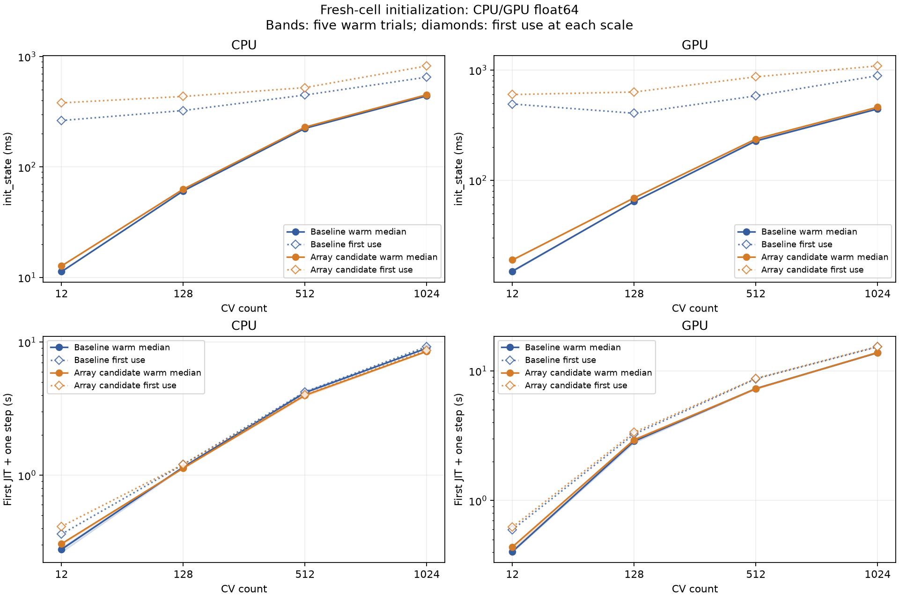

# Continuous arrays: initialization on CPU and GPU

2026-09-10 的第一阶段测量比较静态 NumPy 电缆数值与 JAX 数组原型。
CPU 的预热后 `init_state` 增加 1.42–10.78 ms，每种规模第一次初始化增加
74.83–171.48 ms；GPU 分别增加 3.96–16.43 ms 和 107–284 ms。
CPU 基线修复驱动拼写并经确认重跑后，两个后端的前后对照均已完成。

## 修改范围与问题

候选将面积、比膜电容及两侧半段电阻按完整向量传到设备；运行时 point/ion/clamp
数值也采用 JAX 数组。轴向矩阵、电容归一化和导数路径 Schur 消元改用数组计算。
节点数、整数映射、消元顺序、求解方程和时间步保持原样；dense mixed-node matrix
并未同时改成稀疏算法。

这里测的是数组存储与数值路径迁移的成本，不是完整几何训练接口的成本。
长度、半径、Ra 的参数化、所有派生副本/缓存随训练更新的同步和 Trainable View
仍未实现。[当前数值层](../../../../docs/design/optim/current/runtime-cable-arrays.md)
说明能力边界，[proposal](../../../../docs/design/optim/proposals/nonlinear-pattern-separation.md)
说明后续阶段。

## 环境与代码版本

| 项目 | 实测配置 |
| --- | --- |
| CPU | AMD EPYC 9754，2 sockets × 128 cores × 2 threads，共 512 logical CPUs |
| CPU affinity | 可用 0–511，未设置专门绑核 |
| GPU | 物理 GPU 1，NVIDIA H200，143771 MiB；通过 CUDA_VISIBLE_DEVICES 映射到进程内设备 0 |
| GPU 共用情况 | 启动前 GPU 1 占用约 551 MiB；GPU 0 有其他工作，本实验未使用 GPU 0 |
| 系统 | Linux 6.17.0-35-generic，x86_64，glibc 2.39 |
| Python | 3.12.14 |
| 数值库 | JAX/jaxlib 0.11.1，BrainState 0.5.4，BrainUnit 0.5.2，NumPy 2.5.2 |
| 精度 | 两后端均从初始化开始 float64 |
| 基线源码 | `c70a8b3cdcc867f42d85510f9fe2d5044a05d081`；原工作树额外改动只有不参与驱动的 examples |
| 候选源码 | 同一基线上的 `feat/cv-nonlinear-pattern-separation` 未提交数值层改动 |
| 成功进程的 driver SHA256 | `3a54e62af9ffa1e62c3254d1ad3e5bed858fe83179d0e7a76040520d8dac46bb` |
| 原始材料 | 本地忽略目录 `artifacts/{baseline_cpu_retry1,baseline_gpu,arrays_cpu,arrays_gpu}.json`；失败记录另外保留为 `baseline_cpu.json`；每份包含全量源码文件 SHA256、实际 import 路径及环境 |

四个成功进程的数值源码在测量期间没有修改。CPU 基线重跑使用的全部源码文件 SHA256、
驱动 SHA256 和软件版本均与 GPU 基线相同。未隔离整台主机的其他负载；GPU 基线
尾段与一次 CPU 正确性测试存在时间重叠。每种后端/版本只测一个独立进程，不能据此
估计跨进程方差，也不能把这些百分比概括为其他形态、版本或设备的保证。

## 执行协议与实际次数

一个 soma 和两个多片段 taper 分支，CV 总数依次为 12、128、512、1024，
通过 CVPerBranchList 尽量均分。单 population，均匀初始电压 -60 mV，
leak 为 0.1 mS/cm²、E=-65 mV，cm=1 μF/cm²，Ra=100 Ω·cm。
每个 trial 新建模型，只执行一个 0.025 ms 的 staggered 步长，无训练。

每规模一次完整预热 trial 加五次正式 trial；第一次编译已包含在每个 trial 的
单步执行中，没有额外隐藏 first-use。四个阶段分别计时：声明构造、显式访问 cvs、
init_state、首次 JIT 加一步执行。init_state 自身 clone morphology 并重新离散化，
不会因为之前访问了 cvs 就省略该工作。同步采用 effects barrier 和所有 live device
arrays 的 block_until_ready；同步自身开销包含在阶段计时内。禁用持久编译缓存及
GPU 预分配，import/环境采集不计入阶段时间。first-JIT 不称为稳态仿真吞吐。

计划为 2 revisions × 2 backends，共四个串行进程，每进程上限 600 秒，无自动重试。
实际启动五个进程：四个完成，一个 CPU 基线在创建首个树突分支时因 `dend` 类型拼写失败。
失败进程没有完成任何初始化或仿真；修成 `dendrite` 并补构造回归测试后，用户明确批准
CPU 基线按相同配置重跑一次。重跑进程于 2026-09-10 08:33:58 UTC 启动，24 个 trial
全部完成。失败记录保留，不混入计时样本；其他三组没有重复测量。

实际完成 96 次新模型初始化/单步执行，其中 16 次预热、80 次正式 trial，产生 320 个
正式阶段时间。无额外仿真校验、reset、profiling 或自动重试。已执行的普通代码测试
不作为性能样本；初次错误、测试失败及修复不从原始失败记录中删除。

实际解释器为 `/home/swl/miniforge3/envs/braincell/bin/python`。在
`/home/swl/studio/braincell-nonlinear-pattern-separation` 执行 `benchmark.py`，共同参数是：

```text
--sizes 12 128 512 1024 --warmup 1 --repeat 5
```

四条成功配置分别为：

| label | source-root | backend 参数 |
| --- | --- | --- |
| baseline_gpu | /home/swl/studio/braincell | --platform gpu --gpu 1 |
| arrays_cpu | /home/swl/studio/braincell-nonlinear-pattern-separation | --platform cpu |
| arrays_gpu | /home/swl/studio/braincell-nonlinear-pattern-separation | --platform gpu --gpu 1 |
| baseline_cpu_retry1 | /home/swl/studio/braincell | --platform cpu |

各自用 `timeout 600` 包裹，输出到相应 `artifacts/<label>.json`。

## 结果



实线为预热后五次 fresh-cell trial 的中位数，阴影为 min–max；虚线菱形为该规模
第一个 trial。这里的 first use 不等同于四个规模分别从全新进程启动：较大规模可能
复用前面规模的公共 JAX primitives。完整逐配置表见 [timings](arrays_cpu_gpu/timings.md)。

| Backend | CV | 原版 warm init (ms) | 数组版 warm init (ms) | 增量 (ms) | 相对增量 |
| --- | ---: | ---: | ---: | ---: | ---: |
| CPU | 12 | 11.29 | 12.71 | 1.42 | 12.6% |
| CPU | 128 | 60.75 | 63.03 | 2.27 | 3.7% |
| CPU | 512 | 223.82 | 229.75 | 5.93 | 2.7% |
| CPU | 1024 | 439.70 | 450.48 | 10.78 | 2.5% |
| GPU | 12 | 14.94 | 18.91 | 3.96 | 26.5% |
| GPU | 128 | 64.04 | 69.18 | 5.14 | 8.0% |
| GPU | 512 | 227.48 | 236.68 | 9.20 | 4.0% |
| GPU | 1024 | 443.51 | 459.93 | 16.43 | 3.7% |

GPU 各规模第一次 init_state 从 491.65/405.41/582.80/888.35 ms 变为
598.93/631.46/867.06/1089.17 ms。首次 JIT 的五次中位数则从
0.404/2.868/7.308/13.799 s 变为 0.440/2.938/7.282/13.856 s。

CPU 各规模第一次 init_state 从 263.53/324.49/448.29/650.74 ms 变为
380.77/435.31/523.12/822.22 ms。首次 JIT 的五次中位数从
0.277/1.152/4.175/9.004 s 变为 0.305/1.131/3.988/8.519 s。
这部分包含 tracer 构建、编译、懒装配及一次执行；较大规模的下降不等于稳态仿真加速。

## 正确性及解释边界

每个成功 trial 的已执行电压均为有限 float64，并通过均匀 passive 模型隐式 Euler
解析值检查，无额外模型执行。均匀电压时轴向项为零，该计时驱动本身不能证明非均匀
轴向传播正确。独立 `cable_test.py` 对照分叉/taper 的标量物理矩阵，且在非均匀初态
下检查面积、cm、两侧电阻通过线性电压求解的有限差分梯度；生产 Cell/DHS 另有回归。

最终 CPU 正确性回归为 **243 passed，60 subtests passed**，覆盖 cable、bridge、layouts、
runtime state、Cell、currents、DHS、TrainableManager 和 benchmark 驱动协议。
该回归未启用计时测量；55 条现有警告未作为失败处理。执行命令：

```bash
python -m pytest -q \
  braincell/_compute/cable_test.py braincell/_compute/bridge_test.py \
  braincell/_compute/layouts_test.py braincell/_compute/state_test.py \
  braincell/_multi_compartment/cell_test.py braincell/_multi_compartment/currents_test.py \
  braincell/quad/_staggered_test.py braincell/trainable/_manager_test.py \
  benchmarks/performance/geometry_initialization/benchmark_test.py --disable-warnings --maxfail=2
```

CPU/GPU 结果支持“设备数组准备有可测的首次成本，预热后绝对增量较小”，不支持
“可微化没有初始化损失”。小模型相对变化较大，大模型主要时间仍在原有构建流程。
第一次数组运算可能触发设备 kernel 编译，但这里没有 profiler，不能将所有 first-use
增量定量归因于编译。CPU 基线现已补齐，下一步可据此决定是否减少新数组的 eager 操作、
重复 host 收集或采用按需准备；不提前扩大到 policy/View/训练实验。
