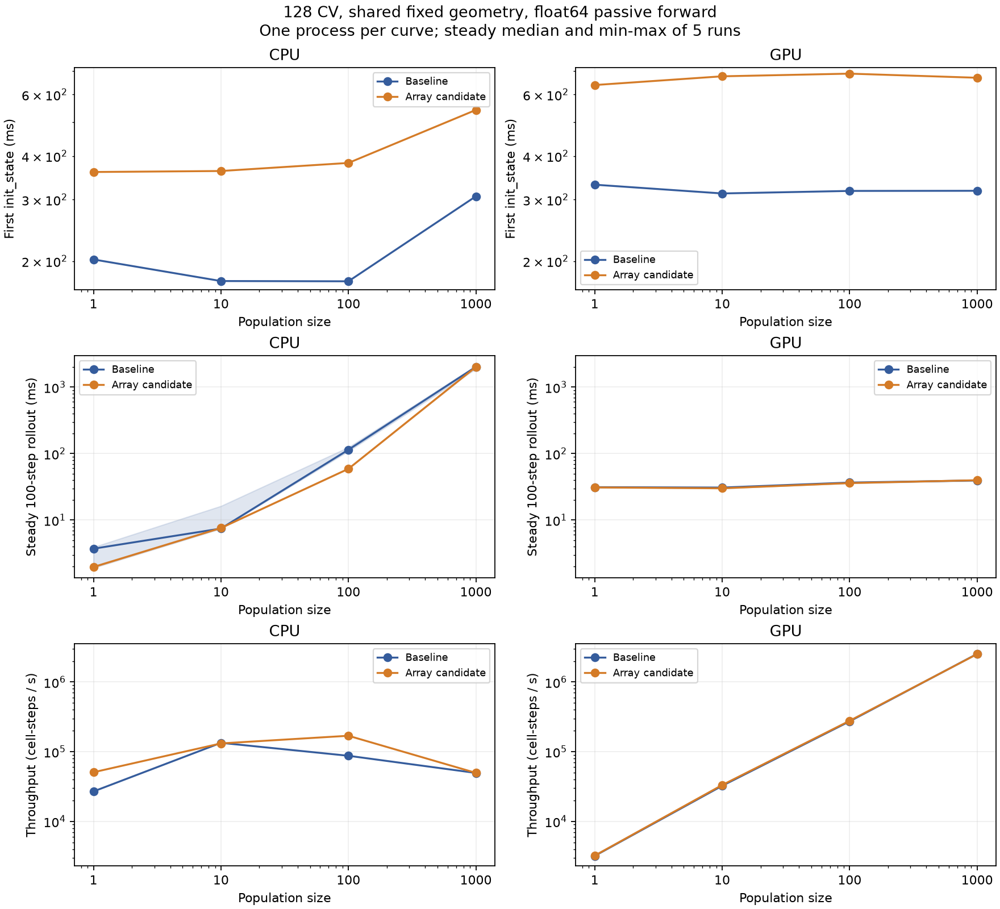

# 128-CV population: initialization and steady simulation

2026-09-10，按用户缩减后的配置固定 128 CV，只扫描 pop_size=1/10/100/1000。
数组原型有明显首次初始化成本，但本轮没有观察到随 population 放大的稳态额外开销：
GPU 新旧耗时差在 -2.6% 至 +0.7% 内；CPU 的 10/1000 档接近，1/100 档候选更快，
尚不能把单进程的下降归因于代码优化。population 本身显著改变 CPU/GPU 的适用规模。

## 环境与版本

| 项目 | 配置 |
| --- | --- |
| CPU | AMD EPYC 9754，2 sockets × 128 cores × 2 threads，512 logical CPUs；可用 affinity 0–511，未专门绑核 |
| GPU | 物理 GPU 1，NVIDIA H200，143771 MiB，启动前约 551 MiB 占用；映射到进程内设备 0 |
| 其他负载 | GPU 0 有其他任务，本实验未使用；整台主机未隔离其他用户负载 |
| 系统 | Linux 6.17.0-35-generic，x86_64，glibc 2.39 |
| Python | 3.12.14；解释器 `/home/swl/miniforge3/envs/braincell/bin/python` |
| 数值库 | JAX/jaxlib 0.11.1，BrainState 0.5.4，BrainUnit 0.5.2，NumPy 2.5.2 |
| 精度 | CPU/GPU 从初始化开始均为 float64 |
| 基线 | `/home/swl/studio/braincell`，commit `c70a8b3cdcc867f42d85510f9fe2d5044a05d081`；额外 examples 改动不参与此驱动 |
| 候选 | `/home/swl/studio/braincell-nonlinear-pattern-separation`，相同基线上的 `feat/cv-nonlinear-pattern-separation` 未提交数值层原型 |
| population.py SHA256 | `7042c97ffde450381b6f902ced02b23b7e026e83b60599b2cf51e923d4017c51` |
| 共享 benchmark.py SHA256 | `59b9f29d66e4baacd87591ae0e12367c80c5e0c06dc54a32916b70d31d96733c` |

四个进程串行，启动时间依次为 09:01:23、09:02:06、09:03:45、09:04:34 UTC。
两后端各自的基线源码哈希相同，候选源码哈希也相同；测量期间未修改驱动或数值实现。
报告生成和本轮协议测试在全部计时完成后运行。每种版本/后端只有一个独立进程，
无法估计跨进程方差。

## 模型与计时

一个 soma 和两个 taper daughter branches，CVPerBranchList 将 128 CV 分为 43/43/42。
共享几何，cm=1 μF/cm²、Ra=100 Ω·cm，passive leak 为 0.1 mS/cm²、E=-65 mV；
使用 staggered solver，无外部刺激。初始电压单位为 mV：

```text
V_init = -65 + linspace(0, 10, pop_size)[:, None]
             + 2 * sin(linspace(0, pi, 128))[None, :]
```

各成员有不同初态，CV 间也有电压梯度。pop_size 是一个 Cell 的向量化 population，
不是多个独立构造的 Cell，不是训练 batch，也没有每成员独立几何。

每个配置只构造和 init_state 一次。每段仿真是编译后的 BrainState for_loop，100 步，
dt=0.025 ms，总生物时间 2.5 ms；只返回最终电压，不收集完整轨迹。
首次 JIT 与执行一次、额外预热一次、正式计时五次，共七段；每段之前 reset，
reset 单独计时。稳态数值为五次完整 100 步耗时中位数，排除 reset、编译及 host 校验。
effects_barrier 与全部 live device arrays 的 block_until_ready 用于同步，包含同步开销。

每配置开始前清除 JAX 编译缓存，同配置七段之间复用编译。禁用持久编译缓存和 GPU
预分配。这里的 init 是单次首次初始化，包含首次设备运算的准备成本；不能与
[此前五次 warm init 中位数](arrays-cpu-gpu.md) 混为同一口径。

实际完成四个进程、16 个配置：16 次新模型初始化、16 次首次编译执行、16 次额外预热、
80 次正式 rollout、112 次 reset，共 112 段完整仿真、11,200 个 population 时间步。
没有失败、超时、重试、profiling、反向传播或额外验证仿真。每进程上限 900 秒，
整组预算 60 分钟，实际运行远低于上限。原拟多 CV 矩阵未启动。

## 结果



图中初始化为每配置的单次值；稳态阴影表示五次 min–max，非置信区间。
CPU/GPU 同一行使用相同纵轴范围。完整初始化、首次编译、稳态区间、reset、
每细胞每步成本和状态字节数见 [timings](population_128/timings.md)。

以下是编译后 **100 步整个人口的耗时（ms）**，不是单细胞或单步耗时：

| pop_size | CPU 原版 | CPU 数组版 | GPU 原版 | GPU 数组版 |
| ---: | ---: | ---: | ---: | ---: |
| 1 | 3.713 | 1.970 | 31.254 | 30.960 |
| 10 | 7.457 | 7.598 | 30.845 | 30.060 |
| 100 | 114.326 | 59.029 | 36.663 | 35.987 |
| 1000 | 2015.971 | 2012.006 | 39.486 | 39.770 |

GPU 数组版相对原版依次为 -0.9%、-2.5%、-1.8%、+0.7%，没有明显稳态退化。
CPU 的 10/1000 档分别为 +1.9%/-0.2%。CPU 的 1/100 档约快一倍，但 1 档基线
范围为 1.912–3.914 ms，本身有明显波动；100 档的两个进程也未隔离调度和主机负载。
本轮保留这些数据，不据此声称可微数组带来稳定加速，也不声称执行程序完全相同。

初次 init_state 的原版 → 数组版（ms）：

| pop_size | CPU | GPU |
| ---: | ---: | ---: |
| 1 | 202.13 → 359.88 | 331.00 → 638.72 |
| 10 | 175.30 → 362.26 | 312.40 → 676.57 |
| 100 | 175.01 → 382.05 | 317.65 → 688.55 |
| 1000 | 306.55 → 541.89 | 317.92 → 670.14 |

新增首次初始化成本 CPU 约 158–235 ms、GPU 约 308–371 ms；没有随 population
增加 1000 倍。首次 JIT 加 rollout：CPU 原版 1.485–3.279 s、数组版 1.497–3.229 s；
GPU 原版 3.691–4.151 s、数组版 3.893–4.355 s。启动阶段的成本不会因稳态接近而消失。

在已测四档里，数组版 CPU 在 1/10 档更快，GPU 在 100/1000 档更快；1000 档 GPU
约快 50.6 倍。GPU 的人口规模扩大时总耗时增长较少，每细胞每步从 309.60 μs 降到
0.398 μs。CPU 则从 19.70/7.60/5.90 μs 变到 1000 档的 20.12 μs，不能假设增大
population 一定改善 CPU 吞吐。这是当前形态、solver、float64 和设备上的观察，
不是通用的 CPU/GPU 切换阈值。

## 共享几何与正确性

候选四个 cable 数组始终为 `(128,)`，合计 4096 bytes，与 population 无关。
电压形状为 `(pop_size, 128)`；记录的逻辑 State 大小新旧一致，依次为
4160、41600、416000、4160000 bytes。此值不是峰值 RAM/VRAM，未覆盖 Python 元数据、
编译程序、临时 buffer 或全部非 State 数组，也不等于实际物理分配量。
共享 cable 不代表总内存或所有初始化工作与 population 无关。

每段已产生的电压通过有限 float64、形状、被动电压范围、population 均匀偏移的
解析衰减及 reset 一致性检查。报告另对保存的最终电压做 16 项比较：每后端的新旧
对照及每版本的 CPU/GPU 对照，各四档；全部通过 rtol=1e-9、atol=1e-7 mV，
最大绝对差为 3.12e-9 mV，未运行额外模型。明细见 [checks](population_128/checks.json)。

驱动先前的普通回归为 9 passed、8 subtests，包含不计时的 3-CV/2-member reset
例子；缩减矩阵后的协议测试为 3 passed、3 subtests。后者只用 fake cases，
没有任何仿真执行。

## 复现与解释边界

在候选工作树执行 `population.py`，共同参数为：

```text
--sizes 128 --pop-sizes 1 10 100 1000 --steps 100 --warmup 1 --repeat 5
```

| 顺序 | label | source-root | backend 参数 |
| ---: | --- | --- | --- |
| 1 | baseline_cpu_population128 | /home/swl/studio/braincell | --platform cpu |
| 2 | arrays_cpu_population128 | /home/swl/studio/braincell-nonlinear-pattern-separation | --platform cpu |
| 3 | baseline_gpu_population128 | /home/swl/studio/braincell | --platform gpu --gpu 1 |
| 4 | arrays_gpu_population128 | /home/swl/studio/braincell-nonlinear-pattern-separation | --platform gpu --gpu 1 |

每条使用上述解释器、`timeout 900`，输出 `artifacts/<label>.json`。这些原始 JSON 和
`artifacts/<label>_voltages/` 仅保存在本地忽略目录；JSON 含源文件哈希、实际 import
路径和全部执行样本。`population_report.py` 可读取它们重建图表，无需重新仿真。

理论上固定几何能让编译器常量折叠或复用派生系数；本轮没有检查编译 IR，因此
只报告实际耗时，不把具体优化机制当作已验证事实。当前 cable 不是 trainable State，
没有在 rollout 中改变几何。未来 L/r/Ra 的参数绑定、派生量/缓存更新、独立 population
几何及 RTRL 的成本仍需在对应接口落地后评估。当前结果支持继续分阶段推进，
不能直接外推到主动通道、长轨迹记录或几何梯度训练。
