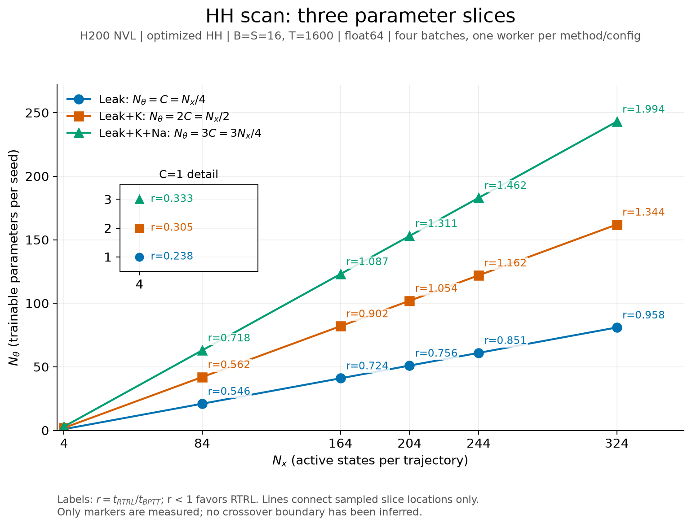
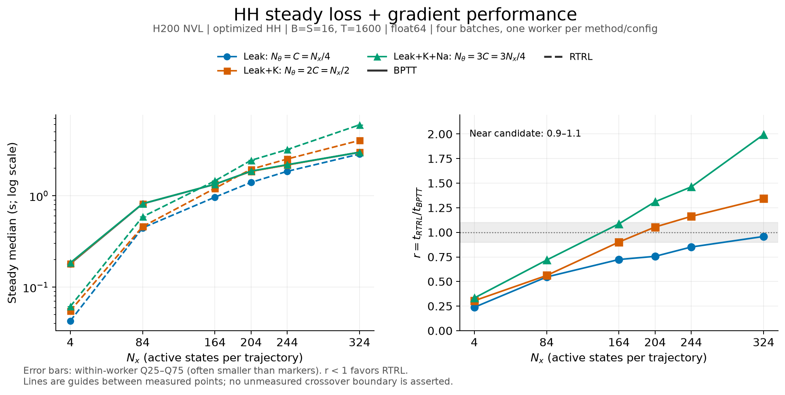
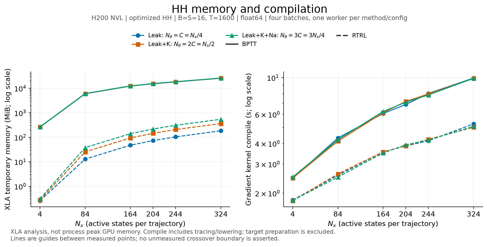

# H200 优化后：完整 HH crossover 扫描（2026-09-12）

本结果汇总四批优化后测量，覆盖 `C=1、21、41、51、61、81`、`Nθ=C/2C/3C`，共 **18 组 BPTT/RTRL 配对、36 个 worker**。实现包含批量 materialize、identity gather 消除与 rollout 入口 materialization；所有 worker 记录 `materialization_mode=rollout`。训练参数仍是 g_max 的 scale。

四批配置互不重叠，每个方法/配置只有一个独立 worker。扫描图统一使用这些优化后数据；优化前图独立保留在 [legacy coarse scan](../before/figures-notes.md)，共同配置的历史对照见下方表格及 [比较范围](../comparison.md)。

## 扫描图与 crossover 判读

- `Nθ=3C`：median 比值从 C=21 的 0.718342 升至 C=41 的 1.0868；换边候选区间为 **C=21–41**，C=41 仍在 10% 接近区。
- `Nθ=2C`：C=41 为 0.901592，C=51 为 1.05425，C=61 为 1.16238；新增点将换边候选区间缩小为 **C=41–51**，两端都在接近区。
- `Nθ=C`：已测范围内 median 始终是 RTRL 更小；C=81 为 0.958162，进入接近区，尚未观察到换边。

`r=t_RTRL/t_BPTT`，r<1 表示 RTRL 更快，`0.9≤r≤1.1` 只标记接近区。每点的 5 个样本来自同一进程，IQR 和图中 Q25–Q75 误差条描述进程内波动，不是置信区间。连线连接已测点，不确定未测位置的精确 crossover；这里不沿用中间批次的线性边界估计。

### 三条参数切片



[SVG](../figures/after/hh_slices_nx_ntheta.svg) · [PDF](../figures/after/hh_slices_nx_ntheta.pdf)

### Runtime ratio



[SVG](../figures/after/hh_runtime_ratio.svg) · [PDF](../figures/after/hh_runtime_ratio.pdf)

### Memory 与 compile



[SVG](../figures/after/hh_memory_compile.svg) · [PDF](../figures/after/hh_memory_compile.pdf)

内存为 XLA temporary MiB，未采集进程峰值显存。Compile 为外层 gradient kernel 的 tracing/lowering/compile 总和，不包含 target 和准备；未额外拆分编译阶段或导出 IR。

## 完整配对数据

时间单位为秒，表中为稳态 median（IQR）。同一 C 下，BPTT 对参数方向数的敏感性较小，而 RTRL 随 Nθ 增长；例如 C=81 时 BPTT 约 3.0 s，RTRL 从 2.86 s 增至 5.98 s。

| C | Nx | Nθ | BPTT s（IQR） | RTRL s（IQR） | r | BPTT temporary MiB | RTRL temporary MiB |
| --- | --- | --- | --- | --- | --- | --- | --- |
| 1 | 4 | 1 | 0.179576 (0.000193644) | 0.0427886 (1.30299e-05) | 0.238277 | 259.629 | 0.258163 |
| 1 | 4 | 2 | 0.181367 (0.000202245) | 0.0552763 (0.000176365) | 0.304775 | 262.756 | 0.277458 |
| 1 | 4 | 3 | 0.185215 (0.000248147) | 0.0616156 (0.000206614) | 0.33267 | 265.883 | 0.309204 |
| 21 | 84 | 21 | 0.81609 (3.8842e-05) | 0.445769 (0.000460743) | 0.546225 | 5975.08 | 12.8417 |
| 21 | 84 | 42 | 0.8195 (0.000584492) | 0.460196 (0.000382631) | 0.561557 | 6040.75 | 25.4076 |
| 21 | 84 | 63 | 0.820741 (0.00048432) | 0.589573 (8.16088e-05) | 0.718342 | 6106.41 | 37.8551 |
| 41 | 164 | 41 | 1.33419 (0.000198496) | 0.96594 (0.00106677) | 0.723987 | 12331.3 | 47.547 |
| 41 | 164 | 82 | 1.33924 (0.000249102) | 1.20745 (0.000383258) | 0.901592 | 12459.5 | 94.2768 |
| 41 | 164 | 123 | 1.34032 (0.000214988) | 1.45666 (0.000531602) | 1.0868 | 12587.7 | 140.796 |
| 51 | 204 | 51 | 1.85464 (0.00128223) | 1.40228 (0.00502852) | 0.756091 | 15304.4 | 72.9562 |
| 51 | 204 | 102 | 1.85289 (0.00464455) | 1.95341 (0.00421567) | 1.05425 | 15463.9 | 145.231 |
| 51 | 204 | 153 | 1.86396 (0.00104861) | 2.44401 (0.00377148) | 1.3112 | 15623.3 | 217.153 |
| 61 | 244 | 61 | 2.17722 (0.0049678) | 1.85272 (0.00470816) | 0.85096 | 18277.9 | 104.133 |
| 61 | 244 | 122 | 2.17405 (0.00316779) | 2.52708 (0.00189342) | 1.16238 | 18468.7 | 207.045 |
| 61 | 244 | 183 | 2.19175 (0.00142715) | 3.20532 (0.00654977) | 1.46245 | 18659.4 | 309.892 |
| 81 | 324 | 81 | 2.98602 (0.00781382) | 2.86109 (0.00137689) | 0.958162 | 25765.6 | 184.281 |
| 81 | 324 | 162 | 3.00321 (0.00465111) | 4.03595 (0.0428244) | 1.34388 | 26018.9 | 365.426 |
| 81 | 324 | 243 | 2.99784 (0.0149364) | 5.9773 (0.0256626) | 1.99387 | 26272.1 | 543.742 |

<details>
<summary>展开 18 组 gradient compile 时间</summary>

| C | Nθ | BPTT compile s | RTRL compile s |
| --- | --- | --- | --- |
| 1 | 1 | 2.45917 | 1.81707 |
| 1 | 2 | 2.46726 | 1.80162 |
| 1 | 3 | 2.50258 | 1.81027 |
| 21 | 21 | 4.31279 | 2.56614 |
| 21 | 42 | 4.13014 | 2.61462 |
| 21 | 63 | 4.20922 | 2.501 |
| 41 | 41 | 6.07025 | 3.55746 |
| 41 | 82 | 6.13864 | 3.55645 |
| 41 | 123 | 6.24551 | 3.50388 |
| 51 | 51 | 6.87827 | 3.86151 |
| 51 | 102 | 7.17645 | 3.86713 |
| 51 | 153 | 7.09926 | 3.92158 |
| 61 | 61 | 8.02426 | 4.15128 |
| 61 | 122 | 7.97345 | 4.23394 |
| 61 | 183 | 7.86228 | 4.19733 |
| 81 | 81 | 9.94954 | 5.24978 |
| 81 | 162 | 9.89693 | 5.01497 |
| 81 | 243 | 9.91305 | 5.06934 |

</details>

## 与优化前相同配置对照

旧数据复用 2026-09-10 [coarse scan](../before/hh-crossover-h200-20260910.md) 和 [C=81 supplement](../before/hh-crossover-h200-20260910-supplement.md)。共同配置为 C=1、21、41、81，合计 24 个同方法对照；C=51/61 没有优化前记录。倍数均为旧耗时/新耗时。

两日期的 GPU、软件版本与 workload 相同，但未锁定 GPU 时钟或 CPU affinity。优化后显式禁用 JAX persistent compilation cache；旧测量没有显式记录这一开关。下表反映累计实现差异，不能单独归因于某一项优化，也不等同于同进程交错 A/B。

| C | Nθ | 方法 | compile 旧→新 s | compile 倍数 | median 旧→新 s | runtime 倍数 | history gradient rel-L2 |
| --- | --- | --- | --- | --- | --- | --- | --- |
| 1 | 1 | BPTT | 3.06212 → 2.45917 | 1.24519 | 0.183171 → 0.179576 | 1.02002 | 1.89498e-15 |
| 1 | 1 | RTRL | 2.1154 → 1.81707 | 1.16418 | 0.0484968 → 0.0427886 | 1.1334 | 0 |
| 1 | 2 | BPTT | 3.91207 → 2.46726 | 1.58559 | 0.193615 → 0.181367 | 1.06753 | 1.72528e-15 |
| 1 | 2 | RTRL | 2.50278 → 1.80162 | 1.38919 | 0.0690595 → 0.0552763 | 1.24935 | 0 |
| 1 | 3 | BPTT | 4.77555 → 2.50258 | 1.90825 | 0.206179 → 0.185215 | 1.11319 | 2.11237e-15 |
| 1 | 3 | RTRL | 2.95829 → 1.81027 | 1.63417 | 0.0774856 → 0.0616156 | 1.25757 | 0 |
| 21 | 21 | BPTT | 192.732 → 4.31279 | 44.6885 | 1.28026 → 0.81609 | 1.56877 | 1.68952e-12 |
| 21 | 21 | RTRL | 23.612 → 2.56614 | 9.20136 | 0.56993 → 0.445769 | 1.27853 | 4.98901e-13 |
| 21 | 42 | BPTT | 389.098 → 4.13014 | 94.2093 | 1.7208 → 0.8195 | 2.09981 | 2.17407e-12 |
| 21 | 42 | RTRL | 46.0878 → 2.61462 | 17.6269 | 0.67668 → 0.460196 | 1.47042 | 8.45452e-13 |
| 21 | 63 | BPTT | 600.458 → 4.20922 | 142.653 | 2.16103 → 0.820741 | 2.63302 | 1.51243e-12 |
| 21 | 63 | RTRL | 73.6008 → 2.501 | 29.4285 | 1.02917 → 0.589573 | 1.74563 | 5.35958e-13 |
| 41 | 41 | BPTT | 79.6066 → 6.07025 | 13.1142 | 4.19389 → 1.33419 | 3.14338 | 3.67504e-12 |
| 41 | 41 | RTRL | 50.7257 → 3.55746 | 14.259 | 1.22065 → 0.96594 | 1.26369 | 4.80038e-12 |
| 41 | 82 | BPTT | 208.337 → 6.13864 | 33.9387 | 7.20601 → 1.33924 | 5.38067 | 1.20048e-12 |
| 41 | 82 | RTRL | 112.84 → 3.55645 | 31.7284 | 1.67968 → 1.20745 | 1.3911 | 1.33355e-12 |
| 41 | 123 | BPTT | 410.228 → 6.24551 | 65.6836 | 9.96703 → 1.34032 | 7.43633 | 4.5435e-12 |
| 41 | 123 | RTRL | 177.081 → 3.50388 | 50.5386 | 2.04701 → 1.45666 | 1.40528 | 2.08774e-12 |
| 81 | 81 | BPTT | 213.097 → 9.94954 | 21.4178 | 8.9497 → 2.98602 | 2.99721 | 3.40419e-12 |
| 81 | 81 | RTRL | 96.222 → 5.24978 | 18.3288 | 2.86095 → 2.86109 | 0.999952 | 1.78343e-12 |
| 81 | 162 | BPTT | 987.216 → 9.89693 | 99.7497 | 15.2023 → 3.00321 | 5.06202 | 1.97089e-12 |
| 81 | 162 | RTRL | 212.635 → 5.01497 | 42.4002 | 4.34762 → 4.03595 | 1.07722 | 1.06563e-12 |
| 81 | 243 | BPTT | 2765.93 → 9.91305 | 279.019 | 21.413 → 2.99784 | 7.14281 | 1.20245e-12 |
| 81 | 243 | RTRL | 337.6 → 5.06934 | 66.5963 | 6.45925 → 5.9773 | 1.08063 | 1.88074e-12 |

C=1/21/41 的 18 个 worker：历史 compile 合计 39.73 min，优化后 1.04 min；worker 墙钟合计从 51.14 min 降至 7.47 min。该批调度墙钟为 7.48009 min，含约 0.013 min 调度开销。

<details>
<summary>展开共同配置的 XLA temporary memory 对照</summary>

| C | Nθ | 方法 | temporary 旧→新 MiB |
| --- | --- | --- | --- |
| 1 | 1 | bptt | 262.759 → 259.629 |
| 1 | 1 | rtrl | 0.258423 → 0.258163 |
| 1 | 2 | bptt | 269.01 → 262.756 |
| 1 | 2 | rtrl | 0.304596 → 0.277458 |
| 1 | 3 | bptt | 275.261 → 265.883 |
| 1 | 3 | rtrl | 0.310226 → 0.309204 |
| 21 | 21 | bptt | 6045.61 → 5975.08 |
| 21 | 21 | rtrl | 12.8461 → 12.8417 |
| 21 | 42 | bptt | 6177.89 → 6040.75 |
| 21 | 42 | rtrl | 25.3459 → 25.4076 |
| 21 | 63 | bptt | 6310.16 → 6106.41 |
| 21 | 63 | rtrl | 37.8225 → 37.8551 |
| 41 | 41 | bptt | 12500.2 → 12331.3 |
| 41 | 41 | rtrl | 47.488 → 47.547 |
| 41 | 82 | bptt | 12805.8 → 12459.5 |
| 41 | 82 | rtrl | 94.1796 → 94.2768 |
| 41 | 123 | bptt | 13111.4 → 12587.7 |
| 41 | 123 | rtrl | 140.956 → 140.796 |
| 81 | 81 | bptt | 26182 → 25765.6 |
| 81 | 81 | rtrl | 184.332 → 184.281 |
| 81 | 162 | bptt | 26880.8 → 26018.9 |
| 81 | 162 | rtrl | 363.388 → 365.426 |
| 81 | 243 | bptt | 27579.7 → 26272.1 |
| 81 | 243 | rtrl | 544.356 → 543.742 |

</details>

## Workload 与测量协议

| 项目 | 实际设置 |
| --- | --- |
| 模型与维度 | 所有 CV paint Leak/K/Na，Nx=4C；依次解冻 Leak、Leak+K、Leak+K+Na 的 g_max scale，Nθ=C/2C/3C |
| Batch 与 seed | B=S=16；参数跨 batch 共享，seed lanes 独立；每次梯度调用含 256 条轨迹；rng_seed=20260828 |
| 时间与精度 | 40 ms，dt=0.025 ms，1600 步，float64 |
| 方法 | staggered solver、recursive backsub、full BPTT 与 exact full-state RTRL；无 optimizer 更新 |
| 执行顺序 | GPU 0 串行，批内 C 升序、同配置两种方法相邻，配置间交替先后顺序 |
| 每个 worker | target 1 次、首次梯度 1 次、额外 warmup 2 次、正式计时 5 次 |
| 实际总量 | 36 target、36 首次梯度、72 warmup、180 正式计时；288 次 gradient + 36 target = 324 次完整 workload |
| 计时范围 | 每次调用内 reset + 完整 loss/gradient，设备同步后结束计时；target、准备、编译、文件保存单列；BPTT backward 包含在 gradient 调用内 |
| 时间与失败 | 无 worker 或总时限，无失败、排除项、重试；无 GPU polling、profiling 或额外校验 rollout |
| Worker 环境 | CUDA_VISIBLE_DEVICES=0、JAX_PLATFORMS=cuda、JAX_ENABLE_X64=1、XLA_PYTHON_CLIENT_PREALLOCATE=false、JAX_ENABLE_COMPILATION_CACHE=false |

四批测量都在 **2026-09-12 UTC**，下表按实际执行顺序列出。batch 墙钟合计 **22.54989 min**，不包含批次间空闲时间；四批是不同配置的补全，不是四轮独立复测。

| 原始 batch ID | C | worker | UTC 起止 | 墙钟 min |
| --- | --- | --- | --- | --- |
| `hh_crossover_optimized_20260912` | 1,21,41 | 18 | 04:03:33.191421–04:11:01.996535 | 7.48009 |
| `hh_crossover_optimized_20260912_c81` | 81 | 6 | 04:14:34.326998–04:20:42.533193 | 6.13678 |
| `hh_crossover_optimized_20260912_c61` | 61 | 6 | 04:29:20.591972–04:34:04.555763 | 4.73274 |
| `hh_crossover_optimized_20260912_c51` | 51 | 6 | 04:36:35.597786–04:40:47.613906 | 4.20028 |

## 环境、源码与正确性

- GPU：NVIDIA H200 NVL，UUID `GPU-2c98f8c9-32c8-3bb9-2b43-7c8f13d4ef6f`，driver 590.48.01，143771 MiB；主机双路 AMD EPYC 9754（512 逻辑 CPU），约 1 TiB RAM。首批报告记录启动时 GPU 无计算进程。
- 软件：braincell 0.1.0、brainstate 0.5.4、brainunit 0.5.2、jax/jaxlib 0.11.1、numpy 2.5.2、Python 3.12.14（GCC 15.3.0）、Linux 6.17.0-35-generic x86_64 / glibc 2.39。
- 四批基础提交均为 `c70a8b3cdcc867f42d85510f9fe2d5044a05d081`，worktree 为 `bench/hh-crossover-coarse`，包含未提交修改。批次间 tracked tree hash 不同；记录的 Python 文件指纹中，差异限于当时的 benchmark.py / benchmark_test.py，核心 solver、manager、gradient 文件指纹一致。每批源码快照独立保留，不能用当前 HEAD 代替测量版本。
- 当前 CLI 的默认 DHS differentiation 设置不能追溯补写进这些历史 trial；各批保存的命令与 source snapshot 是测量版本的依据。
- 18/18 个优化后 BPTT/RTRL 配对通过离线复核，36 份 NPZ 输出全部有限；最大梯度 relative-L2 error 为 `4.4066914e-12`。梯度 shape 为 `(16, Nθ)`，loss 为 `(16,)`，逐步 losses 为 `(16,1600)`。
- loss/逐步 losses 要求 rtol=1e-7、atol=1e-8；gradient 要求 relative-L2≤1e-6 或 max-abs≤1e-8。复用首次输出，校验不增加模型执行。
- 保存的 24/24 个同方法历史对照通过；最大 gradient relative-L2 `4.80038293e-12`、gradient max-abs `2.68782969e-08`、总 loss max-abs `9.79312631e-10`。这些是原测量保存的比较记录；本次核对其优化后计时与合并 trial 一致，未重跑历史模型。
- 全部 36 个 worker 的 median、compile 与 memory 字段和原始 trial 一致；全扫描最大 IQR/median 为 1.0611%（首批 C=1/21/41 为 0.3353%）。尚缺跨进程复测，接近区不能据此宣称稳定优劣。
- 首批原报告记录：启动前 CrossoverProtocolTest 为 10 passed、14 deselected、2 subtests passed，均使用测试替身；未运行整目录模型测试。这是当时的验证记录。

<details>
<summary>展开每批 source fingerprint（SHA-256）</summary>

| batch C | tracked tree | diff |
| --- | --- | --- |
| 1,21,41 | `932ed91f9799371774cd7a25820abb7ee510f31223ef8a4d840ffbc6dadbdec7` | `a198bb380910ae97da12f5fe500a214fe7b5a5510e352a0608a96283565fe751` |
| 81 | `e7cfedc83110108f98dbeae6071c389dddbb254a575a5f105d6927107ea45a64` | `5dd79471aa44b17a059f6b0b0071c0e275795448546b2ab8b08bd696c12f6ce2` |
| 61 | `3ce27324a47db4c9f57742fd84b26faa878cd3dbbad33930f5f1eabf4f39968f` | `f3995e6e62198bea8d3730f129277a5b23bac8140fe0a77a181e29561ebf0c09` |
| 51 | `dc60792aae09fd35d726041eb7800157a3f73e52a4cf0ca830ec36b31e0f0465` | `a7f351e88d1661b3e44c4ea753ea4ff7e2cf0880a955dac98a69b79b01dd2f90` |

</details>

## 文件组织与离线重绘

统一 artifact 为本地 ignored `artifacts/hh_crossover_optimized_h200_20260912/`（相对本实验目录），不随 Git 提供。结果页及展示图供仓库读者直接阅读。

```text
artifacts/hh_crossover_optimized_h200_20260912/
  raw/
    manifest.json                 # 合并清单与四批来源，不是单次 run manifest
    actual_counts.json            # 四批原测量计数汇总
    results.csv                   # 36 个方法结果，含 source_run
    paired_results.csv            # 18 组配对，含 source_run
    trials/                       # 原始 36 JSON + 36 NPZ
    logs/                         # 原始 worker 日志
    provenance/batches/<batch>/   # 每批原始 manifest、counts、CSV、源码快照
    provenance/reports/           # 合并前四份报告快照
  analysis/
    summary.md                    # 合并数据摘要
    historical_comparison.*       # 24 个同方法历史比较（CSV/JSON）
    validation.json               # 离线核对结果
    merge_inventory.json          # 143 个原文件的迁移路径与 SHA-256
    sources/<batch>/              # 分批派生文件与历史分析脚本快照
    figures/                      # 从合并 raw 重绘的 PNG/SVG/PDF 与来源 hash
results/hh_crossover/
  after/optimized.md              # 本页：优化后唯一结果入口
  figures/after/              # 对应三类展示图与 plot_sources.json
```

原目录文件逐个迁移并验证 SHA-256；原始命令、路径、源码 hash 与分批分析保持原样，历史路径只作为 provenance。历史分析脚本不是当前执行入口。合并清单不支持 runner resume，也不应作为新测量的输出目录。日期 2026-09-12 指测量日；本次合并与重绘日期为 2026-09-15，新增模型执行为 **0**。

在仓库根目录用同一个 plot 函数重绘优化后图（只需 NumPy/Matplotlib）：

```bash
python -m benchmarks.performance.optim_gradient_scaling.analysis.hh_crossover.plot \
  benchmarks/performance/optim_gradient_scaling/artifacts/hh_crossover_optimized_h200_20260912 \
  --context 'H200 NVL | optimized HH | B=S=16, T=1600 | float64 | four batches, one worker per method/config'
```

默认输出到输入目录的 `analysis/figures/`；展示副本位于 `results/hh_crossover/figures/after/`，脚本默认不覆盖它。输入 CSV 与 36 个 trial JSON 的 SHA-256 见 [plot_sources.json](../figures/after/plot_sources.json)。

## 详细记录

<details>
<summary>展开 36 个 worker 的内存分项</summary>

所有值单位为 MiB。argument/output/temporary/alias 为 XLA 分析；RTRL carry 为逻辑敏感度大小，均不等于实测峰值显存。

| C | Nθ | 方法 | argument | output | temporary | alias | RTRL carry |
| --- | --- | --- | --- | --- | --- | --- | --- |
| 1 | 1 | bptt | 0.00012207 | 0.19558 | 259.629 | 0 | — |
| 1 | 1 | rtrl | 0.00012207 | 0.19558 | 0.258163 | 0 | 0.0388184 |
| 1 | 2 | bptt | 0.000244141 | 0.195702 | 262.756 | 0 | — |
| 1 | 2 | rtrl | 0.000244141 | 0.195702 | 0.277458 | 0 | 0.0778809 |
| 1 | 3 | bptt | 0.000366211 | 0.195824 | 265.883 | 0 | — |
| 1 | 3 | rtrl | 0.000366211 | 0.195824 | 0.309204 | 0 | 0.117188 |
| 21 | 21 | bptt | 0.00256348 | 0.198021 | 5975.08 | 0 | — |
| 21 | 21 | rtrl | 0.00256348 | 0.198021 | 12.8417 | 0 | 14.0427 |
| 21 | 42 | bptt | 0.00512695 | 0.200584 | 6040.75 | 0 | — |
| 21 | 42 | rtrl | 0.00512695 | 0.200584 | 25.4076 | 0 | 28.2957 |
| 21 | 63 | bptt | 0.00769043 | 0.203148 | 6106.41 | 0 | — |
| 21 | 63 | rtrl | 0.00769043 | 0.203148 | 37.8551 | 0 | 42.7588 |
| 41 | 41 | bptt | 0.00500488 | 0.200462 | 12331.3 | 0 | — |
| 41 | 41 | rtrl | 0.00500488 | 0.200462 | 47.547 | 0 | 53.2419 |
| 41 | 82 | bptt | 0.0100098 | 0.205467 | 12459.5 | 0 | — |
| 41 | 82 | rtrl | 0.0100098 | 0.205467 | 94.2768 | 0 | 107.295 |
| 41 | 123 | bptt | 0.0150146 | 0.210472 | 12587.7 | 0 | — |
| 41 | 123 | rtrl | 0.0150146 | 0.210472 | 140.796 | 0 | 162.158 |
| 51 | 51 | bptt | 0.00622559 | 0.201683 | 15304.4 | 0 | — |
| 51 | 51 | rtrl | 0.00622559 | 0.201683 | 72.9562 | 0 | 82.2898 |
| 51 | 102 | bptt | 0.0124512 | 0.207909 | 15463.9 | 0 | — |
| 51 | 102 | rtrl | 0.0124512 | 0.207909 | 145.231 | 0 | 165.837 |
| 51 | 153 | bptt | 0.0186768 | 0.214134 | 15623.3 | 0 | — |
| 51 | 153 | rtrl | 0.0186768 | 0.214134 | 217.153 | 0 | 250.642 |
| 61 | 61 | bptt | 0.00744629 | 0.202904 | 18277.9 | 0 | — |
| 61 | 61 | rtrl | 0.00744629 | 0.202904 | 104.133 | 0 | 117.636 |
| 61 | 122 | bptt | 0.0148926 | 0.21035 | 18468.7 | 0 | — |
| 61 | 122 | rtrl | 0.0148926 | 0.21035 | 207.045 | 0 | 237.075 |
| 61 | 183 | bptt | 0.0223389 | 0.217796 | 18659.4 | 0 | — |
| 61 | 183 | rtrl | 0.0223389 | 0.217796 | 309.892 | 0 | 358.315 |
| 81 | 81 | bptt | 0.0098877 | 0.205345 | 25765.6 | 0 | — |
| 81 | 81 | rtrl | 0.0098877 | 0.205345 | 184.281 | 0 | 207.226 |
| 81 | 162 | bptt | 0.0197754 | 0.215233 | 26018.9 | 0 | — |
| 81 | 162 | rtrl | 0.0197754 | 0.215233 | 365.426 | 0 | 417.636 |
| 81 | 243 | bptt | 0.0296631 | 0.225121 | 26272.1 | 0 | — |
| 81 | 243 | rtrl | 0.0296631 | 0.225121 | 543.742 | 0 | 631.23 |

</details>

<details>
<summary>展开首次执行、预热与全部正式样本</summary>

全部时间单位为秒，每次同步完成后结束计时；准备包含初始化、target 与单步 tracing 等前置工作。

| C | Nθ | 方法 | 准备 | 首次 | 额外 warmup（2） | 正式样本（5） | min | p90 | worker 墙钟 |
| --- | --- | --- | --- | --- | --- | --- | --- | --- | --- |
| 1 | 1 | bptt | 7.44742 | 0.192187 | 0.179937, 0.179395 | 0.179576, 0.179421, 0.179614, 0.179305, 0.17969 | 0.179305 | 0.17966 | 15.0744 |
| 1 | 1 | rtrl | 10.2351 | 0.0443611 | 0.042843, 0.0426777 | 0.0427886, 0.0425606, 0.0427933, 0.0427803, 0.0429667 | 0.0425606 | 0.0428974 | 16.1293 |
| 1 | 2 | bptt | 7.5453 | 0.193588 | 0.181479, 0.181229 | 0.181367, 0.181126, 0.181451, 0.181249, 0.181483 | 0.181126 | 0.181471 | 15.1342 |
| 1 | 2 | rtrl | 11.0897 | 0.0566595 | 0.0559101, 0.0551682 | 0.0551763, 0.0552763, 0.0553753, 0.055199, 0.0554091 | 0.0551763 | 0.0553956 | 17.0271 |
| 1 | 3 | bptt | 7.10809 | 0.197276 | 0.185282, 0.184979 | 0.18538, 0.184998, 0.185215, 0.185014, 0.185262 | 0.184998 | 0.185333 | 14.796 |
| 1 | 3 | rtrl | 10.5266 | 0.0638518 | 0.0625564, 0.0614476 | 0.0616686, 0.061462, 0.0616156, 0.0614033, 0.0617467 | 0.0614033 | 0.0617154 | 16.5368 |
| 21 | 21 | bptt | 10.5313 | 0.951476 | 0.816447, 0.816903 | 0.816029, 0.816091, 0.816052, 0.81609, 0.816613 | 0.816029 | 0.816404 | 25.3874 |
| 21 | 21 | rtrl | 13.1835 | 0.452714 | 0.445575, 0.446016 | 0.445474, 0.446197, 0.445736, 0.446214, 0.445769 | 0.445474 | 0.446207 | 23.0613 |
| 21 | 42 | bptt | 10.7321 | 0.958824 | 0.819542, 0.819508 | 0.8195, 0.819271, 0.820588, 0.819856, 0.81921 | 0.81921 | 0.820295 | 25.4963 |
| 21 | 42 | rtrl | 14.2243 | 0.467839 | 0.460205, 0.459812 | 0.460309, 0.459825, 0.460196, 0.459926, 0.460481 | 0.459825 | 0.460412 | 24.2435 |
| 21 | 63 | bptt | 11.732 | 0.957054 | 0.820371, 0.820541 | 0.820355, 0.820839, 0.820847, 0.820741, 0.820271 | 0.820271 | 0.820844 | 26.465 |
| 21 | 63 | rtrl | 15.0339 | 0.598012 | 0.589408, 0.589493 | 0.589623, 0.589573, 0.589509, 0.589528, 0.58961 | 0.589509 | 0.589618 | 26.0466 |
| 41 | 41 | bptt | 12.248 | 1.60122 | 1.33407, 1.33442 | 1.33616, 1.33419, 1.33403, 1.33395, 1.33423 | 1.33395 | 1.33539 | 33.2039 |
| 41 | 41 | rtrl | 15.1936 | 0.977893 | 0.966098, 0.971443 | 0.965904, 0.968438, 0.96594, 0.966971, 0.965766 | 0.965766 | 0.967851 | 30.3729 |
| 41 | 82 | bptt | 12.4739 | 1.60547 | 1.33905, 1.33868 | 1.3386, 1.33939, 1.3391, 1.33935, 1.33924 | 1.3386 | 1.33937 | 33.5424 |
| 41 | 82 | rtrl | 16.7509 | 1.21938 | 1.20754, 1.20737 | 1.20753, 1.2068, 1.20745, 1.20715, 1.21156 | 1.2068 | 1.20995 | 33.8363 |
| 41 | 123 | bptt | 14.0703 | 1.60835 | 1.33962, 1.34046 | 1.34032, 1.34018, 1.34045, 1.3404, 1.34001 | 1.34001 | 1.34043 | 35.0621 |
| 41 | 123 | rtrl | 17.5447 | 1.47016 | 1.45666, 1.45643 | 1.45666, 1.45707, 1.46068, 1.45654, 1.45651 | 1.45651 | 1.45923 | 36.628 |
| 51 | 51 | bptt | 13.6175 | 2.16704 | 1.85524, 1.85472 | 1.85602, 1.85464, 1.83399, 1.85419, 1.85548 | 1.83399 | 1.8558 | 39.6256 |
| 51 | 51 | rtrl | 17.1715 | 1.45873 | 1.40011, 1.40152 | 1.40228, 1.40052, 1.40834, 1.38244, 1.40554 | 1.38244 | 1.40722 | 36.1365 |
| 51 | 102 | bptt | 15.7417 | 2.16898 | 1.85741, 1.85451 | 1.82882, 1.85212, 1.85289, 1.85783, 1.85676 | 1.82882 | 1.8574 | 42.045 |
| 51 | 102 | rtrl | 19.4467 | 1.98797 | 1.95381, 1.95431 | 1.9584, 1.95334, 1.92828, 1.95341, 1.95756 | 1.92828 | 1.95806 | 42.7063 |
| 51 | 153 | bptt | 17.1262 | 2.18884 | 1.8275, 1.86414 | 1.86376, 1.86396, 1.86499, 1.86394, 1.86508 | 1.86376 | 1.86504 | 43.4107 |
| 51 | 153 | rtrl | 20.3385 | 2.50806 | 2.44819, 2.44706 | 2.4463, 2.44733, 2.40223, 2.44253, 2.44401 | 2.40223 | 2.44692 | 47.764 |
| 61 | 61 | bptt | 14.7736 | 2.74838 | 2.05587, 2.17386 | 2.17588, 2.17722, 2.18293, 2.18085, 2.17446 | 2.17446 | 2.1821 | 44.7624 |
| 61 | 61 | rtrl | 18.0122 | 1.90243 | 1.85529, 1.85443 | 1.85272, 1.85469, 1.83788, 1.84998, 1.85685 | 1.83788 | 1.85598 | 40.7788 |
| 61 | 122 | bptt | 16.2925 | 2.74777 | 2.17549, 2.17299 | 2.17489, 2.17405, 2.14739, 2.17173, 2.17701 | 2.14739 | 2.17616 | 46.2688 |
| 61 | 122 | rtrl | 19.8945 | 2.58853 | 2.52829, 2.52949 | 2.52708, 2.52623, 2.5088, 2.53451, 2.52812 | 2.5088 | 2.53196 | 48.2578 |
| 61 | 183 | bptt | 18.1767 | 2.77226 | 2.19258, 2.18097 | 2.17069, 2.19221, 2.19568, 2.19078, 2.19175 | 2.17069 | 2.19429 | 48.1817 |
| 61 | 183 | rtrl | 21.636 | 3.20657 | 3.20699, 3.20481 | 3.20532, 3.20552, 3.16492, 3.19897, 3.20706 | 3.16492 | 3.20644 | 55.3819 |
| 81 | 81 | bptt | 16.097 | 3.53421 | 2.98081, 2.99021 | 2.98602, 2.99528, 2.96323, 2.98859, 2.98077 | 2.96323 | 2.9926 | 54.562 |
| 81 | 81 | rtrl | 20.2581 | 2.936 | 2.86391, 2.86323 | 2.8289, 2.85972, 2.86109, 2.86109, 2.86543 | 2.8289 | 2.8637 | 52.5964 |
| 81 | 162 | bptt | 18.4762 | 3.59811 | 2.95652, 3.00588 | 3.00634, 3.00472, 3.00007, 2.95541, 3.00321 | 2.95541 | 3.00569 | 57.1036 |
| 81 | 162 | rtrl | 21.8188 | 4.05886 | 4.03498, 4.03484 | 3.99402, 4.03684, 4.03739, 4.03595, 3.98983 | 3.98983 | 4.03717 | 62.9376 |
| 81 | 243 | bptt | 21.0242 | 3.58303 | 2.99706, 2.99738 | 2.98511, 2.95499, 3.00005, 3.00047, 2.99784 | 2.95499 | 3.0003 | 59.4519 |
| 81 | 243 | rtrl | 24.3582 | 6.03923 | 5.95764, 5.97183 | 5.95574, 5.9814, 5.9773, 5.95326, 5.98177 | 5.95326 | 5.98162 | 81.2013 |

</details>
