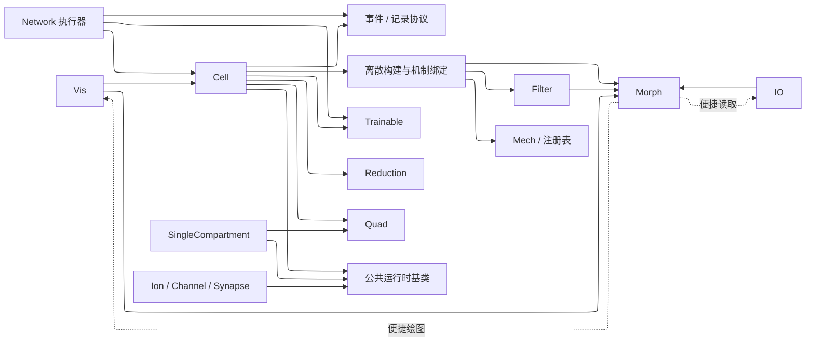
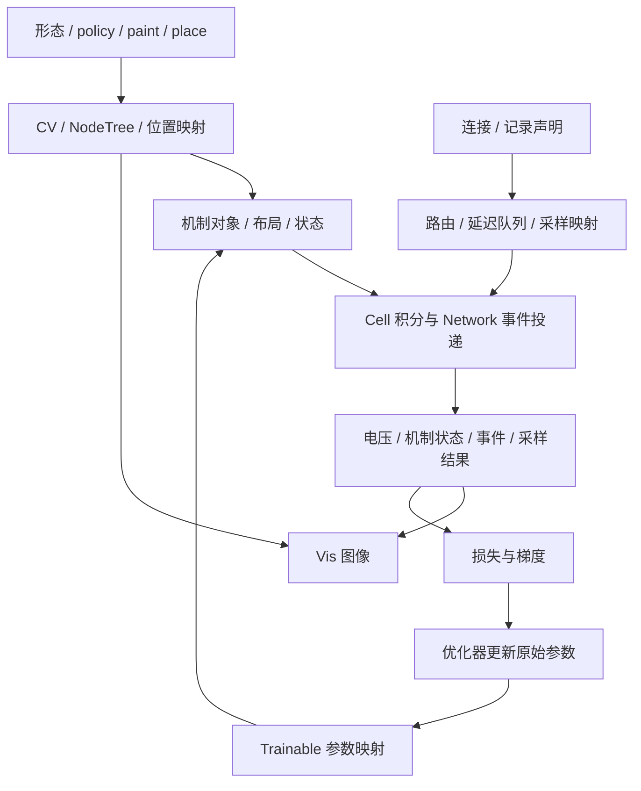

# System Overview

BrainCell 把形态、机制和连接声明构建为可积分的 Cell，再由 Network 组织多个 Cell 的时间推进与事件投递。
Trainable 把优化参数映射到运行时参数，Vis 把形态、离散结构和记录结果变成图像。
这份总览沿这条流程说明模块分工、数据归属和执行约定。

## 模块与核心对象

| 模块 | 输入、产出与职责 | 实现与详细文档 |
| --- | --- | --- |
| IO | 从 SWC、ASC 等外部格式构建 Morphology，保存和恢复形态数据 | [API](../../io/current/api.md)、[NeuroMorpho](../../io/current/neuromorpho.md) |
| Morph | 用 Branch 描述几何，用 Morphology 组织树；提供视图和几何度量 | [API](../../morph/current/api.md)、[分层约束](../../morph/current/layering-invariants.md) |
| Filter | Region 选择空间区域，Locset 选择位置；表达式在形态和离散上下文中求值 | [API](../../filter/current/api.md)、[连续采样](../../filter/current/sampling.md)、[空间参数](../../filter/current/spatial-callable-parameters.md) |
| Mech | 保存电缆属性、密度机制和点机制声明；通过注册表定位运行时类 | [API](../../mech/current/api.md)、[架构](../../mech/current/architecture.md) |
| Cell | 持有声明，构建 CV 与节点树，绑定机制、状态和求解器 | [实现](../../../../braincell/_multi_compartment)、[API](../../cell/current/api.md)、[架构](../../cell/current/architecture.md) |
| Ion / Channel / Synapse | 实现离子、通道和突触的电流与内部动力学 | [Ion API](../../ion/current/api.md)、[Channel API](../../channel/current/api.md)、[Synapse API](../../synapse/current/api.md) |
| Quad | 提供积分协议、机制积分器和树形电压求解器，推进 Cell 及机制状态 | [API](../../quad/current/api.md)、[架构](../../quad/current/architecture.md) |
| Network | 注册 population，构建事件路由并协调 Cell 推进；汇总采样和事件结果 | [实现](../../../../braincell/network)、[API](../../network/current/api.md)、[架构](../../network/current/architecture.md) |
| Trainable | 注册原始参数和绑定关系，将参数变换后的物理量写入既有运行时布局 | [实现](../../../../braincell/trainable)、[API](../../optim/current/api.md)、[架构](../../optim/current/architecture.md) |
| Reduction | 在同一个 Cell 上挂载替代动力学，消费已投递的突触输入并返回约化模型输出 | [接入指南](../../reduction/current/model-integration-guide.md) |
| Vis | 读取形态、Cell 拓扑或数组，生成静态图、轨迹和动画 | [实现](../../../../braincell/vis)、[API](../../vis/current/api.md) |
| SingleCompartment 与公共基类 | 集中参数模型使用独立执行路径；与 Cell 共享 HHTypedNeuron、离子/通道基类及积分设施 | [SingleCompartment](../../../../braincell/_single_compartment/base.py)、[统一提案](../../cell/proposals/single-multi-compartment-unification.md) |

下面表示主要依赖：实线从使用方指向提供方；虚线表示便捷方法中的延迟导入。
图按职责合并内部模块，具体构建与绑定代码由 Cell 架构展开。



Morphology 的文件读取与绘图快捷方法在调用时导入 IO、Vis。Vis 可以读取 Cell，
Cell 的仿真路径则不需要绘图库；Matplotlib、PyVista 等后端按需加载。
这个约束由 [Morph 守护测试](../../../../braincell/morph/__init___test.py) 和
[Vis 守护测试](../../../../braincell/vis/__init___test.py) 检查。

Network 执行器依赖 Cell，Cell 则使用 `network.event`、`network.recording` 中的协议和记录类型。
因此 Python 包的依赖并非简单的上下分层；图中将事件与记录协议单独列出，区分它们与执行器的职责。

## 从声明到结果

下面的箭头均表示数据流。声明决定运行时结构，优化器更新原始参数后，Trainable 将新值写回同一结构。



### 构造 Cell 和事件输入

以下三个代码块按顺序运行。例子使用一个 branch、两个 CV 的被动 Cell，
在中点放置一个指数突触，并将漏电导的缩放因子注册为可训练参数。

```python
import braincell as bc
import brainstate
import braintools
import brainunit as u
import jax.numpy as jnp
from braincell.filter import AllRegion, RootLocation

soma = bc.Branch.from_lengths(
    lengths=[20.0] * u.um, radii=[10.0, 10.0] * u.um, type="soma",
)
morpho = bc.Morphology.from_root(soma, name="soma")
cell = bc.Cell(morpho, cv_policy=bc.CVPerBranch(2), V_init=-65.0 * u.mV)
cell.paint(
    AllRegion(),
    bc.mech.CableProperty(
        membrane_capacitance=1.0 * u.uF / u.cm**2,
        axial_resistivity=100.0 * u.ohm * u.cm,
        resting_potential=-65.0 * u.mV,
    ),
    bc.mech.Channel("IL", name="leak", g_max=0.1 * u.mS / u.cm**2, E=-65.0 * u.mV),
)
cell.place(RootLocation(0.5), bc.mech.Synapse("ExpSyn", name="syn", tau=2.0 * u.ms))
cell.loc(RootLocation(0.5)).record("v_mid", bc.observe.state("v"))
cell.channels["leak"].trainable(
    g_max=bc.trainable.scale(brainstate.nn.Param(1.0), name="leak_factor"),
)

stim = bc.NetStim(start=0.25 * u.ms, number=1, interval=10.0 * u.ms)
bc.connect("input", source=stim, synapse=cell.synapses["syn"],
           weight=0.001 * u.uS, delay=0.1 * u.ms)
net = bc.Network("example")
net.add_population("post", cell)
net.add_population("input", stim)
```

`paint` 将密度机制应用到区域，`place` 将点机制放到位置；二者保存声明，
初始化时才实例化运行时机制。`record` 保存观测声明，采样映射复用已有空间结构。
连接的目标突触属于 Cell；Network 注册的 population 引用这个 Cell。

### 运行、读取和绘图

```python
dt = 0.025 * u.ms
result = net.run(dt=dt, duration=1.0 * u.ms, event_backend="scatter")
block = result.samples["post"]["v_mid"]
assert cell.V.value.shape == (1, 2)
assert block.values.shape == (40, 1)

from braincell import vis

topology = vis.plot_cell_topology(cell, level="cv", value="V", layout="kamada_kawai")
traces = vis.plot_traces(
    cell.morpho, block.time, block.values,
    locset=RootLocation(0.5).evaluate(cell.morpho), layout="fan", shape="line",
)
assert topology.figure is not None
assert len(traces.trace_axes) == 1
```

`Network.run` 首次调用会初始化模型；返回值覆盖本次运行区间。
`SampleBlock.values` 的列与 `schema.rows` 对齐，这里只有一个 population 成员、一个记录位点。
Vis 的 Cell 入口是 `vis.plot_cell_topology(cell, ...)`；轨迹入口接收时间和二维数组，
此例的数组列顺序正好对应传入的 Locset。完整签名、空间索引与返回对象见 [Vis API](../../vis/current/api.md)。

### 参数如何进入梯度计算

继续使用上面的 Network。`prepare_run` 构建单步执行器；每次求损失先重置动力学状态，
再通过 `update` 推进并直接读取电压。这里的损失是轨迹相对 -60 mV 的均方差，演示一次参数更新。

```python
net.prepare_run(dt=dt, event_backend="scatter")
states = net.trainables.parameters().states()
optimizer = braintools.optim.Adam(lr=0.01)
optimizer.register_trainable_weights(states)

def loss():
    net.reset_state()

    def step(_):
        net.update()
        return cell.V.value.to_decimal(u.mV)[0, 0]

    voltage = brainstate.transform.for_loop(step, jnp.arange(40))
    return jnp.mean((voltage - (-60.0)) ** 2)

gradient = brainstate.transform.grad(loss, grad_states=states, return_value=True)

@brainstate.transform.jit
def train_step():
    gradients, value = gradient()
    optimizer.update(gradients)
    return value

value = train_step()
assert bool(jnp.isfinite(value))
```

Network 的参数集合聚合各 Cell 的原始 `Param`，按对象身份去重，保留原对象引用。
优化器更新这些参数；初始化、运行入口和单步 `update` 中的 materialize 根据绑定关系计算物理量，
写入机制或连接的参数缓冲。动力学状态、原始参数和物理参数缓冲因此有不同的生命周期。
更完整的目标轨迹拟合见 [突触学习示例](../../../../examples/optim/parameter_learning/synapse_learning.py)。

## 数据归属与生命周期

| 数据 | 持有者与共享关系 | 何时建立或更新 |
| --- | --- | --- |
| Branch、Morphology 与空间表达式 | 用户构造；声明期 Cell 引用传入的 Morphology | 形态可在初始化前编辑；几何查询缓存按形态身份与 revision 失效 |
| policy、paint/place、连接和记录声明 | Cell 保存模型声明；连接由目标 Cell 管理，Network 汇总查询 | 初始化前添加，初始化后结构冻结 |
| CV、NodeTree、位置映射 | Cell 的离散缓存 | 声明期按需构建；初始化时在克隆后的形态上重建 |
| 布局、机制实例、参数和事件缓冲 | CellRuntimeState 及关联存储 | 初始化时绑定；固定形状下更新数值 |
| 电压、spike、时间 | Cell；机制门控、浓度、突触状态由具体机制实例持有 | 积分推进或 reset_state 重置 |
| population、事件路由和延迟队列 | Network；population 引用原 Cell 或事件源 | 注册后构建执行配置；每步投递、入队和推进 |
| 记录 schema 与结果 | Cell 声明观测；执行器产出 SampleBlock / EventSeries | 每次运行生成对应时间段的结果 |
| 原始 Param 与绑定 | Cell 的 TrainableManager；Network 提供聚合视图 | 初始化前注册绑定；优化器更新参数，materialize 写入运行时 |
| 图像和绘图布局缓存 | Vis 与返回的 Figure / Axes 等对象 | 绘图时读取当前数据；仿真推进不会自动刷新旧图 |

`Cell.init_state()` 克隆形态、构建离散结构并绑定机制，然后初始化状态。
`reset_state()` 保留布局和参数根，重置电压及机制等运行状态；`reset()` 丢弃运行时并恢复声明期形态引用。
两种 reset 的调用条件见 [Cell 生命周期](../../cell/current/api.md#生命周期)。

独立 Cell 可以 `run`；加入 Network 后由 Network 统一推进和重置。
Network 首次准备运行后固定步长、事件后端和延迟量化配置，后续 `run` 在同一时间线上继续。
重复实验使用 `net.reset_state()`，参数绑定和执行配置随之保留。

## 状态轴与空间映射

| 表达 | 含义 |
| --- | --- |
| `pop_size + (n_cv,)` | 未额外 batching 的 Cell 膜电压布局；默认 `pop_size=(1,)`，上例为 `(1, 2)` |
| `pop_size + (n_point,)` | 电气节点布局，包括 CV 中心及边界/连接节点；用于点机制装配与节点电压求解 |
| 机制布局行 | 经空间选择和机制绑定生成；局部行索引通过布局映射回 CV 或 point |
| `(n_times, n_rows)` | 上例的规则采样结果；每列的 population、位置、字段和单位由 recording schema 解释 |
| Vis 的 branch / segment / centerline / CV / node 值 | 对应不同的几何或电气索引；调用时按入口指定的空间传值 |

独立 Cell 的 `init_state(batch_size=...)` 可再增加前置 batch 轴；Network 当前拒绝该参数，
通过 Cell 的 `pop_size` 表示 population。机制与记录布局的完整轴约定见模块 API。

CV 是膜面积、电容和密度机制的空间单元；point 是电压方程中的节点。
因此单 branch、单 CV 仍可包含两个端点和一个 CV 中心。SingleCompartment 的单行 ODE
没有这两行边界约束，状态轴也不自动带 Cell 的末尾 CV 轴；统一方式见
[Single/MultiCompartment 提案](../../cell/proposals/single-multi-compartment-unification.md)。

膜电压满足电流平衡：`C dV/dt = I_membrane + I_injected + I_axial`。
这里 C 是 CV 总电容，电流以流入 CV 为正；密度电流乘膜面积后才与点电流相加。
几何面积、轴向电导及节点消元的公式见 [Cell 几何计算](../../cell/current/architecture.md#几何计算)。

## 时间推进与求解路径

Network 每步先准备外部输入与 pre 采样，再投递到期事件并更新突触输入，随后推进 Cell。
Cell 更新之后处理即时零延迟事件、post 采样及输出事件，再将延迟事件入队并推进队列。
事件延迟如何量化、零延迟何时生效见 [Network 执行架构](../../network/current/architecture.md)，
逐步顺序可核对 [Network 执行器](../../../../braincell/network/engine.py)。

Cell 默认使用 staggered：电压阶段读取旧机制状态，在节点树上通过 DHS 解线性电压系统；
机制阶段使用新电压更新门控等状态。依赖离子总电流的机制按快照与调度约定读取电流。
通用 Euler/RK 等路径通过导数协议推进，轴向算子消去边界节点后作用于 CV 电压。
当前这条显式路径对端点点机制的反馈存在缺项，具体反例和方案见
[边界输入提案](../../cell/proposals/explicit-solver-boundary-inputs.md)。

两条路径的装配、离子电流快照及更新顺序由 [Cell 求解架构](../../cell/current/architecture.md#电压与电流路径)
维护。Network 的 `run` 负责收集运行结果；可微训练使用准备好的 `update`，
在 `brainstate.transform.for_loop` 等变换中直接读取状态并构建损失。

Cell 也可以通过 `use_model(name)` 选择已挂载的 ReductionModel，替代详细动力学。
这时 Network 仍管理原 Cell 的连接和事件投递，约化模型接收分组的突触输入并持有自己的动态状态；
输入 schema、输出记录及生命周期见 [约化模型接入指南](../../reduction/current/model-integration-guide.md)。

## 单位、参数与外部依赖

仿真入口的长度、时间、电压、电流等参数使用 `brainunit.Quantity`，例如 `0.025 * u.ms`。
密度电导与突触总电导分别使用 `u.mS / u.cm**2` 和 `u.uS`，二者通过膜面积建立联系。
无量纲参数根可以经 Trainable 的映射产生带单位物理量；梯度损失和绘图需要纯数组时，
用 `.to_decimal(unit)` 明确选定单位。Vis 也接受纯数值数组，其单位标签由调用方指定。

| 依赖 | 在执行流程中的作用 |
| --- | --- |
| BrainState / JAX | 状态管理、编译循环、自动微分与设备数组计算 |
| BrainUnit | 物理量运算、单位转换和量纲检查 |
| BrainTools | 参数变换、优化器、代理梯度等工具 |
| BrainEvent | 可选事件执行路径中的稀疏算子 |
| BrainPy / NumPy / SciPy | 动力学与科学计算工具 |
| Matplotlib / PyVista | Vis 的二维和三维后端，使用时加载 |

版本约束和 extras 由 [pyproject.toml](../../../../pyproject.toml) 维护。
Vis 迁移到 BrainTools、提供简单绘图与 GUI 的方案见 [Vis TODO](../../vis/TODO.md)。

## 公共入口与设计讨论

公开导入从 `braincell` 顶层或已公开的领域子包进入，具体导出见
[顶层入口](../../../../braincell/__init__.py) 和各子包 `__all__`。
实现放在 `_discretization` 等内部路径，不改变其顶层重导出对象的公开身份；
例如使用 `bc.CVPerBranch`，实现位置则供开发者查阅。

实验接口通过 `braincell.experimental` 显式导入，例如
`from braincell.experimental import optim`。该命名空间不列入顶层 `braincell.__all__`，
裸 `import braincell` 不保证提前加载它；实验接口可以独立于稳定接口演进。
具体使用方式见 [实验工作流](../../optim/current/experimental-workflows.md)。

当前 `bc.mech.Channel` / `bc.mech.Ion` 是声明，`bc.Channel` / `bc.Ion` 是运行时基类。
跨模块命名与公共导出约定见 [接口一致性讨论](../proposals/interface-consistency.md)；
模块内部接口问题进入对应 TODO，系统级进度见 [Architecture TODO](../TODO.md)。
