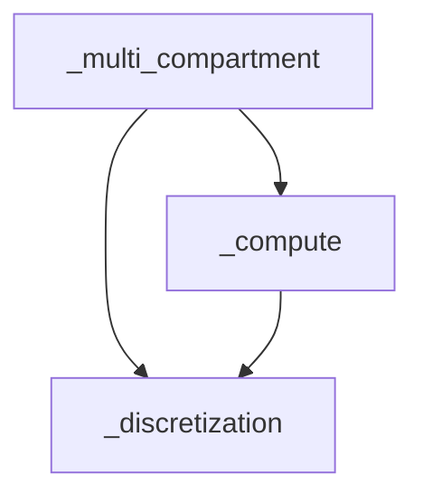
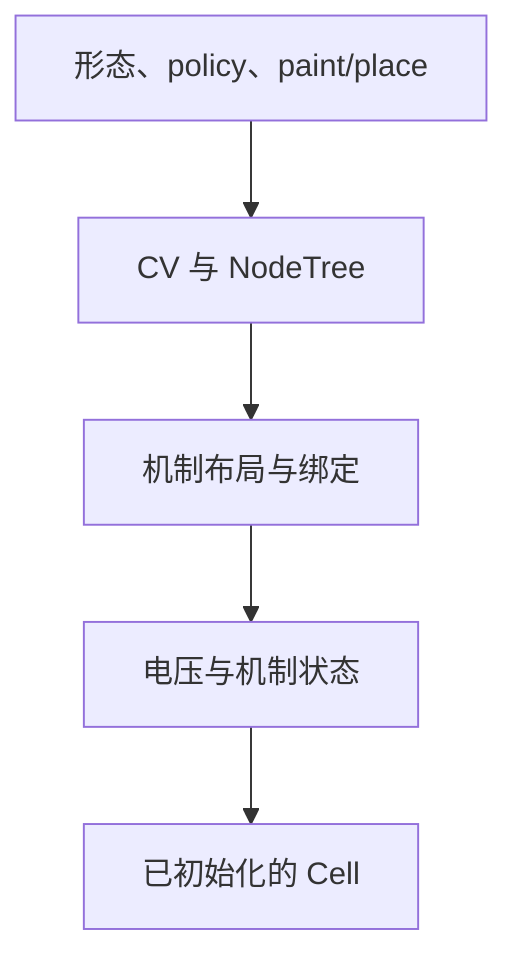

# Cell 架构

详细电缆 Cell 将形态与机制声明转换成 CV、电气节点和机制状态，再交给 solver 推进。
建模调用见 [Cell API](api.md)，约化模型的宿主路径见
[模型接入指南](../../reduction/current/model-integration-guide.md)。

| 要理解的问题 | 章节 |
| --- | --- |
| 数据由谁持有、哪些对象共享 | [模块分工](#模块分工)、[数据归属](#数据归属) |
| 声明如何成为可运行模型 | [从声明到运行时](#从声明到运行时) |
| CV、边界节点与机制状态如何对应 | [CV 与 Point](#cv-与-point)、[状态布局](#状态布局) |
| 一步积分如何消费电流并更新状态 | [电压与电流路径](#电压与电流路径)、[离子电流快照与调度](#离子电流快照与调度) |

## 模块分工

下图只表示三个内部包的依赖方向：箭头从使用方指向提供方。



| 模块 | 职责与主要产物 |
| --- | --- |
| [`_multi_compartment/cell.py`](../../../../braincell/_multi_compartment/cell.py) | 用户声明、生命周期与运行阶段编排；`currents.py` 汇总电流，`probes.py` 查询观测，`run.py` 执行连续推进 |
| [`_discretization`](../../../../braincell/_discretization) | `policy` 划分 branch 区间，`geometry` 计算几何，`mechanism` 解析声明，`node_build` 构造电气节点；`base.build_discretization` 汇总为 `Discretization` |
| [`_compute`](../../../../braincell/_compute) | `layouts` 定义机制空间索引，`ions/bindings` 创建并绑定运行时机制，`state` 分配状态；`bridge` 映射 CV/point，`table` 提供机制查询，`scheduling` 构造树求解顺序 |
| [`quad`](../../../../braincell/quad) | 积分协议、机制积分器与电压求解器；默认 staggered 调用 DHS 求解节点树 |

## 数据归属

Cell 是声明和运行时的宿主，机制声明与实际参与积分的机制对象分别保存：

| 数据 | 持有者 | 创建与更新时机 |
| --- | --- | --- |
| 原 morphology、policy、paint/place 规则 | Cell 声明 | 构造及声明操作；原 morphology 可由多个 Cell 引用 |
| CV、NodeTree、placement 与空间上下文 | Cell 的 Discretization 缓存 | 按声明按需重建；初始化后对应形态快照 |
| layout、运行时机制对象、参数 buffer、事件 buffer | CellRuntimeState | `from_cell` 构建；运行阶段读写已有 buffer |
| `V`、`spike`、当前时间 | Cell | 初始化创建，积分与循环驱动更新 |
| 门控、浓度、连续突触等动态状态 | 运行时 channel / ion / synapse 对象 | 机制的 init/reset 钩子创建或重置，积分器推进 |
| point 电压、轴向算子、DHS 工作数据 | Cell 与求解器缓存 | 按求解路径准备；边界电压由 DHS 约束求解 |

布局 buffer 提供参数和声明值的空间存储，机制对象持有自身动力学状态，两者通过绑定连接。
因此 `get_state(layout_id, name)` 查询的是注册 buffer；任意隐藏状态通过相应机制对象读取。
公共读取与赋值入口见 [运行时查询](api.md#运行时查询)。

## 从声明到运行时

下面的箭头表示数据构建顺序，与上面的依赖图含义不同。



以 API 页的三 CV 模型为例，`paint` 保存密度通道声明，`place` 保存刺激的原始位置。
`record` 单独保存观测声明，不新增点机制或改变机制布局。
静态查询通过 `build_discretization` 生成三个 CV、五个 point，以及声明到这些位置的映射。
此时可以检查几何和 placement，运行时机制状态尚未创建。

`init_state()` 复制形态并重新离散，随后 `CellRuntimeState.from_cell` 分配布局与 buffer，
实例化并绑定运行时机制。Cell 将它们挂到运行时对象树，物化已注册的可训练参数，创建
`V/spike` 等状态，再在 group-state 上下文中调用机制的初始化与重置钩子。
离子与通道的依赖绑定因此先于状态初始化，初态读取的是已解析的参数和 CV 电压。

声明或形态 revision 改变会使静态缓存失效。`reset_state()` 复用运行时结构，
`reset()` 则丢弃运行时并恢复原声明期形态引用；具体调用条件见 [生命周期](api.md#生命周期)。

树调度由 `build_node_scheduling` 从 NodeTree 构建。DHS 静态求解数据与通用导数使用的
CV 轴向矩阵分别按需求建立，初始化不会预先构造稠密 CV 轴向矩阵。

## CV 与 Point

一个 CV 覆盖一个 branch 区间，并承载一个动态膜电压。NodeTree 另保留无膜电容的
边界节点，用于端点和分叉处的电流平衡。例如单 branch、三个 CV：

```text
位置 x      0       1/6       1/2       5/6       1
角色      边界 ---- CV0 ---- CV1 ---- CV2 ---- 边界
电压      V_p       V_0       V_1       V_2      V_d
膜电容     0        C_0       C_1       C_2       0
```

这是三行膜电压 ODE 加两行边界代数约束。内部 CV 分界 `x=1/3, 2/3` 不创建节点。
一般构建规则为每个 CV 一个中点、根端点及每个 branch 的末端节点，分叉连接处共享节点。
单 branch、单 CV 因此有三个点，但只有一个动态膜电压自由度。

CV 字段与单位见 [静态查询](api.md#静态查询)。当前 CV 表示限于单 branch 区间。
跨 branch 的连通区间表示及其属性汇总见
[Arbor 参考](../references/arbor-cv-discretization.md)，候选演进见
[两个类的统一](../proposals/single-multi-compartment-unification.md)。
类型与构建依据为 [base.py](../../../../braincell/_discretization/base.py)、
[node_build.py](../../../../braincell/_discretization/node_build.py)。

### 几何计算

离散保留 CV 区间内原有的几何采样点，在截断边界插值半径和可用空间坐标。
一个 CV 可以包含多个圆台片段，直接对这些片段计算：

$$
L_{\mathrm{CV}}=(\mathrm{dist}-\mathrm{prox})L_{\mathrm{branch}},\qquad
A_{\mathrm{CV}}=\sum_k A_k,\qquad
R_{\mathrm{axial}}=R_{\mathrm{prox}}+R_{\mathrm{dist}}.
$$

$A_k$ 为第 k 段圆台侧面积；两个半区间的轴阻使用该 CV 解析出的 `ra` 和原始半径分布计算，
对应 `r_axial_prox`、`r_axial_dist`。长度、面积、轴阻分别具有长度、面积、电阻单位。
总膜电容为 $C_{\mathrm{tot}}=\mathrm{cm}\,A_{\mathrm{CV}}$。
计算实现见 [geometry.py](../../../../braincell/_discretization/geometry.py)。

## 状态布局

令 `P=cell.pop_size`，`N=cell.n_cv`；可选 batch 轴位于 population 轴之前。

| 数据 | 空间轴与作用 |
| --- | --- |
| `Cell.V` | `P + (N,)`，可增加前置 batch 轴；使用 `DiffEqGroupState` |
| density channel / ion 状态 | CV 尾轴；机制自身的状态维度由其模型定义 |
| 普通点布局 | 以活跃 point/placement 行代替 CV 轴，通过 layout 索引读取对应电压 |
| packed 突触布局 | 将不同成员的逻辑突触打包为一条行轴，由 population 与 point 索引共同映射电压 |
| point 电压和 DHS 工作区 | NodeTree 电气点轴，包含 CV 中点及边界代数节点 |

例如 `pop_size=(2,)`、三个 CV 时，V 的形状为 `(2, 3)`；带 `batch_size=4` 时为 `(4, 2, 3)`。
五个 point 不会使 V 变为长度五的状态。
机制隐藏状态在 group-state 上下文中创建，空间尾轴参与积分器的状态合并。
独立 `SingleCompartment` 的膜电压则为 `DiffEqSingleState`，没有空间尾轴。
布局索引依据见 [MechanismLayout](../../../../braincell/_compute/layouts.py)。

## 电压与电流路径

### 单步编排与时间

独立 `Cell.update()` 的外层顺序为：

1. 准备本步 clamp，应用已准备的突触事件。
2. 调用 `solver(cell)` 推进连续状态。
3. 清除本步离子电流快照，检测新旧电压的阈值跨越并写入 spike。
4. 准备下一步突触输入。

`update()` 读取环境时间或 Cell 当前时间，本身不推进时钟。`run()` 通过编译循环管理每步
时间，收集记录，并在时间段结束后更新 `current_time`。Network 执行时，时间与延迟事件
到达由 Network 调度；这些 Cell 内部阶段由其调用。

### 两条电压路径

| 阶段 | 默认 staggered / DHS | 通用电压导数，供显式 Euler/RK 等使用 |
| --- | --- | --- |
| 电流求值 | `total_membrane_rate_point`：密度机制读取 CV 电压，点突触读取所在 point 电压，clamp 进入对应 point | `total_membrane_current(host, V_cv=V, t=t)`：密度机制读取 CV 电压，点机制经 CV/point 映射求值 |
| 膜电流汇总 | 中点按膜电容处理，边界绝对电流进入约束行 | CV 密度电流加中点输入，再除以比膜电容 |
| 轴向处理 | 在 NodeTree 上装配含边界行的时间离散系统 | `build_cv_axial_operator` 对纯轴向矩阵消去边界；`compute_axial_derivative` 应用所得算子 |
| 电压推进 | `dhs_voltage_step` 同时求解边界电压和 CV 电压 | `compute_voltage_derivative` 返回膜导数与轴向导数之和，由积分器推进 |
| 机制推进 | 电压求解后使用新电压更新机制 | 各积分 stage 经 `compute_derivative` 求值，独立积分机制按其协议推进 |

通用导数在 CV 空间计算：

$$
\dot{\mathbf V}
=\mathbf j_{\mathrm{mid}}(\mathbf V,z,t)\oslash\mathbf c_m
-A_{\mathrm{CV}}\mathbf V.
$$

这里 $\mathbf j_{\mathrm{mid}}$ 为密度机制及中点输入汇总的膜电流密度，向内为正，
$\mathbf c_m$ 为比膜电容，$z$ 为当前机制状态，$\oslash$ 表示逐元素除法。
$A_{\mathrm{CV}}$ 是含电容归一化的约化轴向算子，单位为时间的倒数；两项均为电压/时间。
代码中的 `Cell.C` 保存比膜电容，与几何段落的总膜电容 $C_{\mathrm{tot}}$ 区分。

通用路径中，`bridge.cv_to_point` 只写中点电压，`point_to_cv` 只取中点贡献。
因此端点 clamp 的电流及端点突触的电压反馈没有进入 CV 导数。
五节点系统的完整方程、正确消元后的缺项和待验证场景见
[边界输入提案](../proposals/explicit-solver-boundary-inputs.md)。

源码入口：[电流汇总](../../../../braincell/_multi_compartment/currents.py)、
[空间映射](../../../../braincell/_compute/bridge.py)、
[staggered 与轴向算子](../../../../braincell/quad/_staggered.py)、
[Runge-Kutta](../../../../braincell/quad/_runge_kutta.py)。

## 离子电流快照与调度

默认 `cache_ion_total_current=True`。staggered 在电压和机制更新前，为标记
`uses_total_current` 的离子模型计算并缓存旧状态总电流，避免读取部分更新后的通道状态；
关闭后由模型按其电流计算路径求值。

电压求解后，`ion_channel_update_order` 决定机制更新顺序：

| 设置 | 顺序 |
| --- | --- |
| `"family"`，默认 | 连续突触状态，然后离子自身状态，再更新通道；各类内部按是否独立积分分组 |
| `"integration"` | 按顶层运行时节点的积分类型组织，先更新非独立状态，再调用独立更新入口 |

两条路径均按机制选用相应积分器。staggered 的电压阶段读取旧机制状态，机制阶段读取新电压，
构成一阶分裂。此顺序属于 Cell 的调度契约；离子反应声明见
[KineticIon](../../ion/current/kinetic-ion.md)。实现与回归入口见
[Cell](../../../../braincell/_multi_compartment/cell.py)、
[staggered](../../../../braincell/quad/_staggered.py)、
[Cell 测试](../../../../braincell/_multi_compartment/cell_test.py)；NEURON 比较配置见
[小脑比较进度](../../../../validation/neuron/cerebellum-import-progress.md)。
